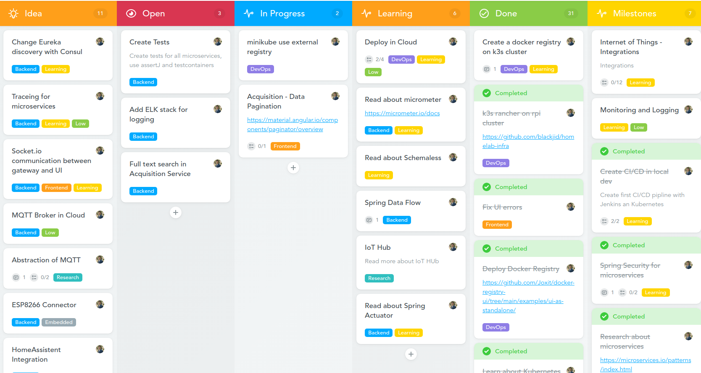
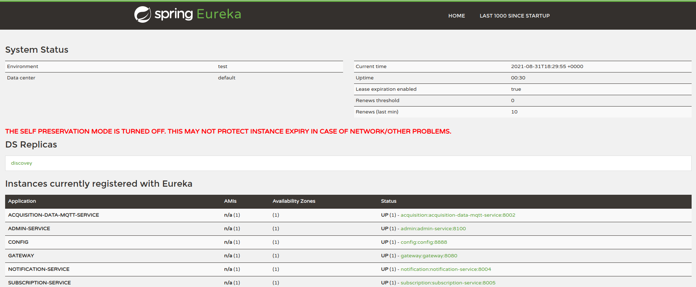
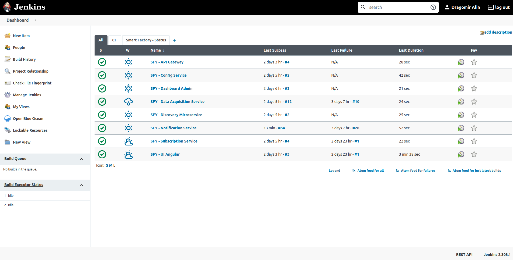
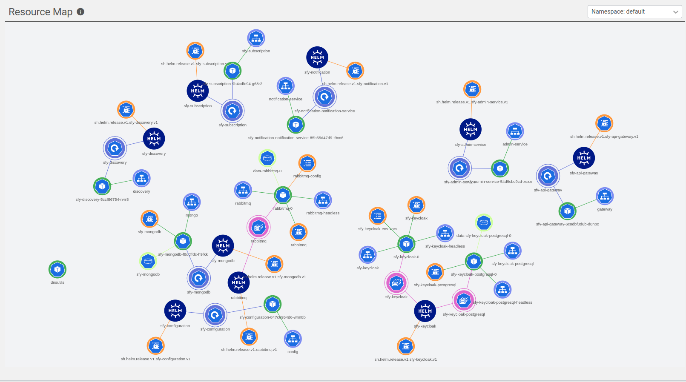
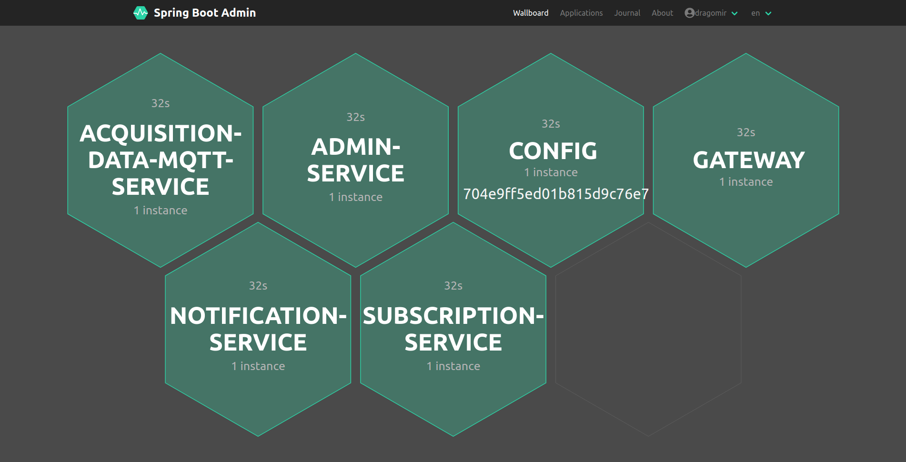
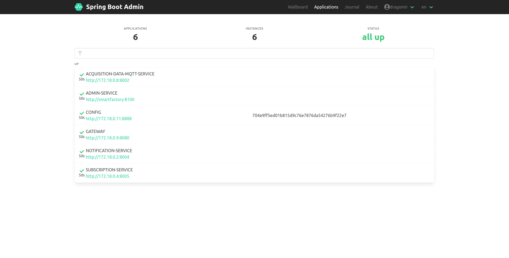
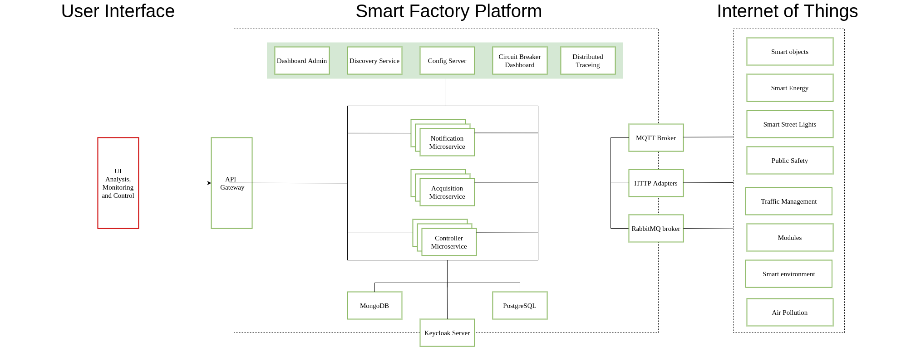

# Smart Factory Platform
Smart Factory is an IoT opensource project whose main purpose is to monitor, verify, manage, control and maintain sensors, modules, devices and smart objects in Smart City, Smart Environments and many others. This project was born from my passion for technology, microservices, cloud and internet of things.

I chose the microservice architecture for this project because IoT means Big Data and needs to be scalable, available and flexible.

In developing this project, I will use a lot of tools to learn how to use them and to find the best solutions for the use cases of the project.

The documentation is constantly improving.

If you want to contribute or/and learn, come on. The main purpose of this project is educational.
> Everything we do is practice for something greater than where we currently are.  Practice only makes for improvement.  – Les Brown

## Software Stack and Tools:
Languages:
<ul>
<li>Java 17 LTS</li>
<li>Typescript 4.1</li>
</ul>

#### Frameworks & Tools
| Technology type  | Name  |
|:--------------------- |:----------------- |
| Frontend Framework | Angular 12
| Backend Framework | Spring Framework
| | Spring Boot
| CSS framework | Bootstrap 5
| Build tool | Maven 

#### Cloud Environment: Spring Cloud
| Technology type  | Name  |
|:--------------------- |:----------------- |
| API gateway |  Spring Cloud Gateway
| Centralized configuration | Spring Cloud Config
| Declarative HTTP client | Spring Cloud OpenFeign
| Service discovery | 	Spring Cloud Netflix Eureka / Spring Consul
| Circuit breaker | Spring Cloud Netflix Hystrix
| Client-side load balancing  | Spring Cloud Netflix Ribbon

#### Logging, Monitoring & Notification
| Technology type  | Name  |
|:--------------------- |:----------------- |
| Distributed tracing | Spring Cloud Sleuth
| Distributed tracing  | Zipkin
| Search and Analytics engine | Elasticsearch
| Process logs | Logstash
| Analytics and Visualization | Kibana
| Monitor and Manage | Spring Boot Actuator
| Microservices state | Spring Boot Admin

#### Messaging:
| Technology 
|:--------------------- 
| RabbitMQ | 
| MQTT | 

#### Databases:
| Technology | Descripion  |
|:---------------------|:---------------------  
| NoSQL | MongoDB
| SQL | Postgres

#### Security: 
| Technology  | Descripion  |
|:--------------------- |:----------------- |
| OAuth 2.0 |  Protocol
| Keycloak |  Identity and Access Management

#### Testing:
| Technology | Descripion  |
|:--------------------- |:----------------- |
| JUnit |  Backend
| Karma  |  Frontend
| Sonar Cloud | Code Quality & Security

#### CI/CD:
| Technology  | Type  |
|:--------------------- |:----------------- |
| Github Actions |  Cloud
| Jenkins |  Local
| Docker | Containerization
| Docker Registry | Docker Hub

#### Deployment:
Kubernetes - Automating deployment, scaling, and management.
| Technology  | Type  |
|:--------------------- |:----------------- |
| minikube | local development
| k3s      | staging - [Raspberry Pi 4 Cluster](https://github.com/DragomirAlin/raspberry-k8s-cluster)
| Openstack Magnum | production

## Internet of Things
A list of devices compatible with this system. The list is constantly growing with the development of new adapters and source codes for devices.

| Type  | Description  | Communication | Implementation
|:--------------------- |:----------------- |:-----------------| :----------------- |
| Module |  ESP8266 | MQTT | In progress
| Module |  ESP32 | MQTT | In progress
| SBC | Raspberry PI | HTTP/MQTT | In progress
| Device | Google Home | HTTP | In progress

### Embedded
Languages:
<ul>
<li>C++</li>
<li>Python</li>
</ul>

## Organization
For organization and planning I use Meistertask.

## Development Tools
| Name | Description  | 
|:--------------------- |:----------------- |
| Github |  Git repository hosting service 
| Git |  Version control 
| IntelliJ IDEA | Java development
| WebStorm | Frontend development
| PyCharm | Scripting development
| VS Code | YAML Editor
| Slack | Webhooks notification
| Meistertask | Planning/Organization
| Lens K8s |The Kubernetes IDE
| Postman | Test API
| Swagger | Create API
| MongoDB Compass| GUI for MongoDB
| MQTTfx | MQTT client
| DBeaver | GUI for SQL
| Arduino | Embedded dev

## Desktop Dev
| Name | Version | 
|:--------------------- |:----------------- |
| Ubuntu | 20.04

## Features and Requirements
#### Functional requirements 
* Data ingestion and stream processing
* Device management
* Edge computing
* Advanced analytics
* Notification/Alerting
* Enterprise integration with business
systems.
#### Non-functional requirements 
* Security
* Stability
* Scalability
* Reliability
* Resistance
* Interoperability
* Maintainability
* Accessibility
## Arhitecture
#### Draw
#### UML

## Repositories
| Name  | URL
|:--------------------- |:----------------- 
| Data Acqusition | [DragomirAlin/smartfactory-data-acquisition-microservice](https://github.com/DragomirAlin/smartfactory-data-acquisition-microservice)
| Deployment | [DragomirAlin/smartfactory-deployment](https://github.com/DragomirAlin/smartfactory-deployment)
| Frontend | [DragomirAlin/smartfactory-ui-angular](https://github.com/DragomirAlin/smartfactory-ui-angular)
| Subscription Service | [DragomirAlin/smartfactory-subscription](https://github.com/DragomirAlin/smartfactory-subscription)
| API Gateway | [DragomirAlin/smartfactory-api-gateway](https://github.com/DragomirAlin/smartfactory-api-gateway)
| Dashboard Admin | [DragomirAlin/smartfactory-admin](https://github.com/DragomirAlin/smartfactory-admin)
| Discovery Service | [DragomirAlin/smartfactory-discovery-service](https://github.com/DragomirAlin/smartfactory-discovery-service)
| Config Service | [DragomirAlin/smartfactory-config-microservice](https://github.com/DragomirAlin/smartfactory-config-microservice)
| Notification Service | currently: private

# pictures from the project

